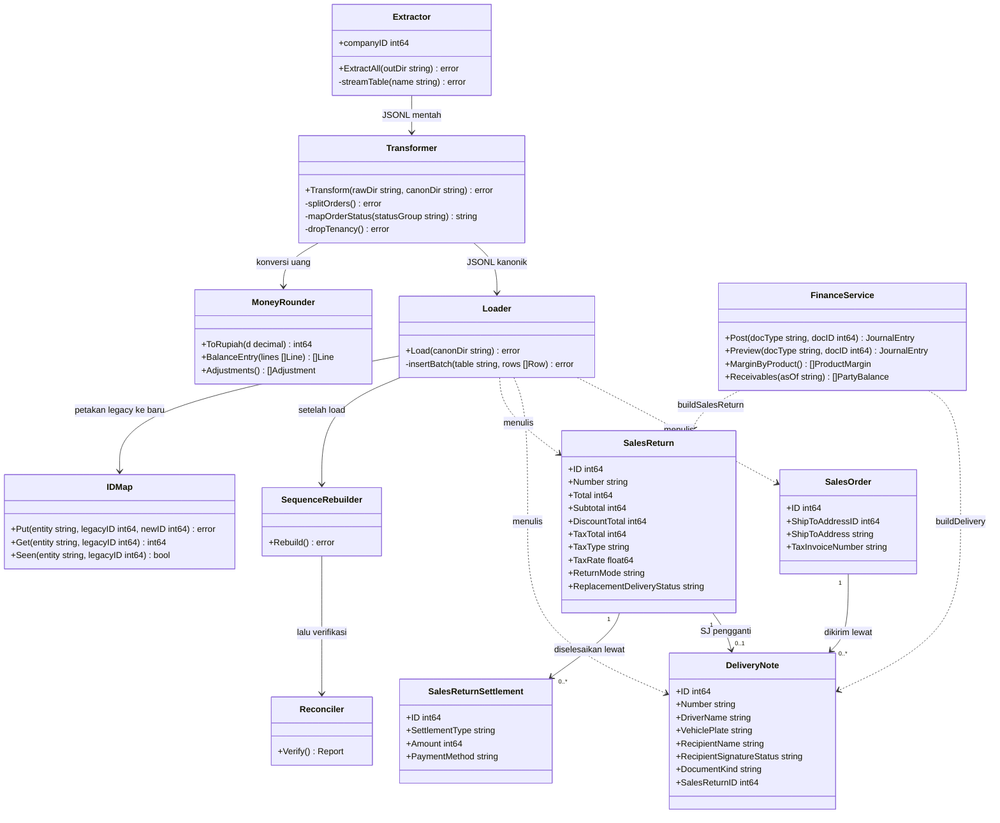
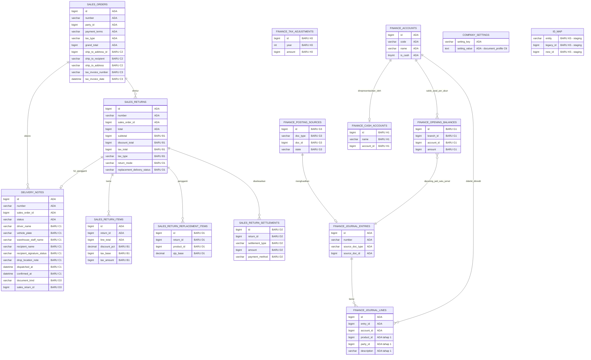
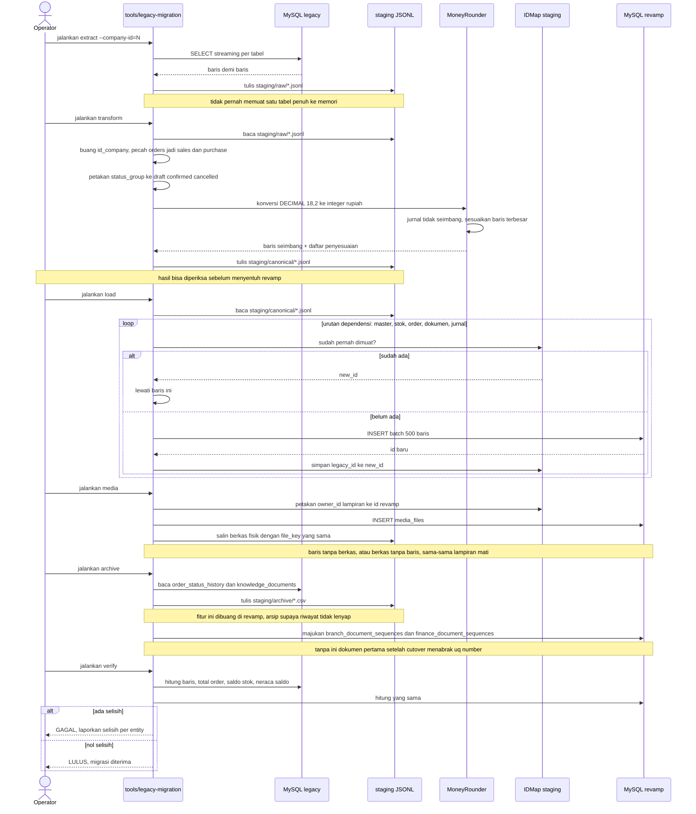
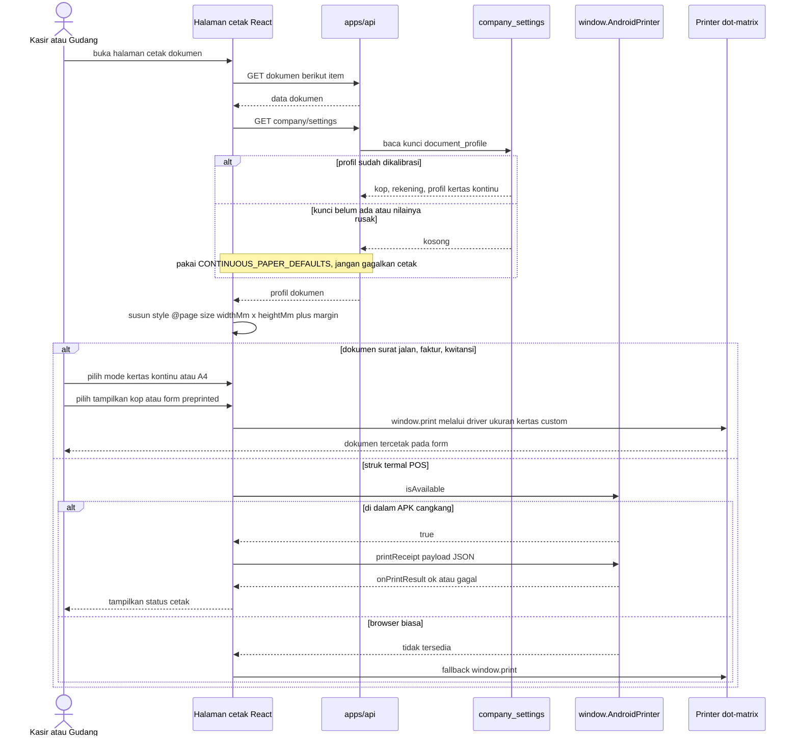

# PLAN — Penutupan Gap Kapabilitas & Migrasi Data Produksi

**Proyek:** mini-erp revamp (`/dimasprasetio/SAAS/mini-erp-revamp`)
**Sumber data lama:** `/dimasprasetio/SAAS/mini-erp` (NestJS + TypeORM, multi-tenant)
**Tanggal:** 2026-09-10
**Basis analisis:** [`docs/PARITY_AUDIT.md`](../../PARITY_AUDIT.md) — audit paritas yang sudah
diverifikasi ulang, dengan bukti `file:baris`.
**Finalisasi senior 2026-09-11:** konflik G/H diputus — task tabel G1/G3/H1/H3 **DIBATALKAN**,
diganti implementasi revisi tanpa tabel baru (sesuai `docs/DB_SCHEMA.md` §6 yang terkunci dan kode
yang sudah ada: `finance/application/queue.go`, `opening.go`, `readiness.go`, `taxadjust.go`,
`finance/presentation/closing.go`, `PostingPage.tsx`). Syarat Tahap K ditulis ulang mengikuti
keputusan ini. J1 backend + tombol frontend selesai sesi ini. Duplikasi `lineEconomics`/`prorate`
antar modul adalah **desain yang disengaja** (lihat catatan baru di §5.3), bukan reuse yang tertunda.
**Finishing 2026-09-11 (sesi lanjutan):** J2/J3/J4 selesai penuh — generator & cetak label QR
(`products/{id}/qr` + varian/size, `products/qr-codes/export` ZIP, modal QR, halaman cetak
`/print/labels`), antrian kerja pengiriman (`deliveries/work-queue` + halaman Antrian Kirim),
pindah lokasi satu langkah (`stock/transfers/move-location` + modal) — semuanya tanpa migrasi
baru, dengan test §7 yang diperbarui di bawah.

---

## 1. Pernyataan Kebutuhan yang Sudah Disepakati

Revamp harus **memenuhi seluruh kapabilitas sistem lama**, tetapi dengan schema, mekanisme, dan
algoritma yang ideal — bukan port 1:1. Setelah itu, **seluruh data produksi sistem lama
dimigrasikan** ke database revamp, disesuaikan dulu dengan schema baru, lalu diimpor. Kedua
aplikasi terpisah dan tidak saling terikat.

**Klasifikasi intent: New capability (program).** Tiga jenis pekerjaan bercampur di dalamnya, dan
pembedaan ini menentukan ketatnya verifikasi tiap tahap:

| Jenis | Contoh di rencana ini |
|---|---|
| **Bug fix** (uang aktif) | Nilai retur mengabaikan PPN & diskon (Tahap B) |
| **Enhancement** | Dashboard operasional (Tahap F), POS kredit (Tahap I) |
| **New capability** | Cetak dot-matrix (E), retur tukar (D), saldo awal finance (G), ETL (K) |

Target kualitas yang diminta pemilik, dikutip apa adanya: *"aplikasi dengan code yang
maintainability, structure rapi dan ideal, efisien, dan optimal."* Bagian §4 menerjemahkan itu
menjadi aturan yang bisa diperiksa, bukan slogan.

---

## 2. Keputusan Terkunci

Setiap baris di bawah adalah jawaban yang benar-benar diberikan, bukan asumsi. Yang ditandai
*(analis)* adalah keputusan yang didelegasikan ke saya dan dicatat sebagai keputusan saya.

| # | Keputusan | Sumber |
|---|---|---|
| **D1** | **Nilai retur mengikuti nilai asli** — diskon proporsional ikut, PPN ikut dibalik. Butuh kolom baru di `sales_returns` & `purchase_returns` | Pemilik |
| **D2** | **Migrasi penuh seluruh riwayat transaksi**, dipetakan ke schema revamp yang lebih ideal | Pemilik |
| **D3** | Kedua aplikasi **terpisah, tanpa keterikatan**. Migrasi berjalan **sekali, offline**: ekstrak → sesuaikan → impor. Tidak ada sinkronisasi berjalan, tidak ada tulis-ganda. Sistem lama tetap bisa dibuka sementara waktu, lalu dimatikan | Pemilik |
| **D4** | **Status order konfigurable & PWA tetap dibuang** — tidak dikembalikan | Pemilik |
| **D5** | **Cetak dokumen memakai browser print + `@page` seukuran form fisik**, dengan profil kertas yang bisa dikalibrasi. **Bukan PDF server-side** | *(analis)* — lihat §3.1 |
| **D6** | **Struk termal POS tetap lewat printer Android**; jembatan native diport ulang | Pemilik |
| **D7** | ETL memakai **tabel pemetaan terpisah di staging**, bukan kolom `legacy_id` di tabel revamp | *(analis)* — lihat §3.2 |
| **D8** | ETL hidup **di luar `apps/api`** (`tools/legacy-migration/`) | *(analis)* — dipaksa oleh guardrail, lihat §3.3 |

### 2.1 Konsekuensi yang perlu Anda sadari

**D2 dan D4 bertabrakan di satu titik.** "Migrasi penuh seluruh riwayat" tidak bisa mencakup
**riwayat status order** (`order_status_history`) dan **dokumen knowledge**, karena kedua fiturnya
sengaja dibuang dan tabel penampungnya tidak ada di revamp. Data itu akan hilang saat sistem lama
dimatikan.

Mitigasi murah yang sudah masuk task list (**K8**): ekspor kedua tabel itu ke berkas arsip CSV
saat cutover. Biayanya satu query, dan riwayatnya tetap bisa dibuka kalau sewaktu-waktu
dibutuhkan. Ini rekomendasi, bukan keputusan yang sudah Anda ambil — kalau Anda memilih
membiarkannya hilang, coret K8.

---

## 3. Keputusan Desain dari Hasil Telusur

### 3.1 Cetak: kenapa bukan PDF (D5)

Rekomendasi awal saya adalah PDF server-side. **Telusur membatalkannya.** Sistem lama sudah
memecahkan cetak dot-matrix dengan cara yang diverifikasi lewat tes cetak fisik, dan
pengetahuannya tercatat di
[`apps/web/src/types/shared.ts:58`](../../../../mini-erp/apps/web/src/types/shared.ts) milik
sistem lama:

- Kertas kontinu 9,5" × 5,5" → `widthMm: 241.3`, `heightMm: 139.7`.
- `marginRightMm: 37.91` **bukan margin visual** — itu kompensasi jangkauan print head
  narrow-carriage (Epson LQ-310) yang hanya ±7,85" dari tepi kiri, jauh lebih sempit dari kertas.
- `widthMm` **tidak boleh disempitkan**: `@page` harus identik dengan ukuran kertas custom yang
  terdaftar di driver, atau sebagian browser jatuh ke fallback yang salah — sudah pernah terjadi
  dan diverifikasi.
- `showLetterhead: false` untuk form yang kop/rekeningnya sudah preprinted.

PDF akan dikirim ke dot-matrix dalam **mode grafis**: lambat, kualitas lebih buruk, dan seluruh
kalibrasi di atas jadi tidak berlaku. Jadi rencananya **memport pendekatan lama**, bukan
menggantinya. Yang diperbaiki adalah tempat profilnya hidup: di revamp ia jadi satu kunci JSON di
`company_settings` (lihat C6), bukan tersebar di `uiPreferences`.

### 3.2 ETL: kenapa tabel pemetaan terpisah (D7)

Loader butuh memetakan `legacy_id → new_id` untuk menyelesaikan relasi. Dua jalan:

| Opsi | Konsekuensi |
|---|---|
| Kolom `legacy_id` di tiap tabel revamp | 20 modul tercemar kepentingan migrasi **selamanya**, padahal migrasi hanya terjadi sekali |
| **Tabel `id_map` di database staging** | Database revamp tetap bersih; seluruh jejak migrasi hilang begitu staging dihapus |

Opsi kedua yang dipakai. Ini langsung melayani target *"structure rapi dan ideal"*: target tidak
boleh menanggung beban sumber.

### 3.3 ETL: kenapa di luar `apps/api` (D8)

Bukan preferensi — dipaksa guardrail repo sendiri.
[`scripts/arch-check.mjs:75-82`](../../../scripts/arch-check.mjs) menolak token `id_company`,
`company_id`, `companyId`, `idCompany` **di mana pun di bawah `apps/api`**. ETL wajib membaca
`id_company` legacy (ada di 46 entity), jadi ia tidak bisa hidup di sana tanpa melumpuhkan
guardrail-nya.

`tools/legacy-migration/` juga otomatis lolos Rule A (batas contracts-only hanya berlaku di
`internal/modules/`), sehingga loader boleh menulis tabel lintas modul — yang memang dibutuhkan,
karena data historis tidak boleh dipaksa lewat aturan bisnis dokumen baru.

---

## 4. Prinsip Desain — "Ideal, Optimal, Efisien" yang Bisa Diperiksa

Empat aturan berikut mengikat seluruh tahap. Setiap task di §6 harus lolos keempatnya.

**P1 — Kolom hanya untuk yang bervariasi di tempatnya.** Sudah terbukti di Tahap 1: baris jurnal
mendapat 4 dimensi, bukan 7 seperti legacy, karena `order_id`/`payment_id`/`movement_id` sudah
terwakili di level entry. Aturan yang sama berlaku ke depan.

**P2 — Tidak ada blob yang tidak bisa di-query.** `metadata_json` legacy tidak dibawa. Kalau
sebuah nilai layak difilter atau dijumlahkan, ia jadi kolom; kalau tidak, ia tidak perlu disimpan.

**P3 — Satu query berkelompok, bukan satu query per baris.** Setiap laporan dan setiap tahap ETL
harus punya jawaban eksplisit atas "berapa query untuk N baris". Jawaban yang mengandung N ditolak.

**P4 — Seimbang menurut konstruksi, bukan menurut pembulatan.** Sisi lawan sebuah jurnal dihitung
sebagai jumlah dari sisi yang sudah dibulatkan, bukan dibulatkan sendiri. Ini yang membuat tiga
bug uang di Tahap 1 tidak bisa terulang.

---

## 5. Cakupan

### 5.1 Masuk cakupan

Backend `apps/api/internal/modules/`: `salesreturn`, `purchasereturn`, `delivery`, `sales`,
`finance`, `dashboard`, `reporting`, `stock`, `payment`, `company`, `branch`, `product`.
Frontend `apps/web/src/modules/`: `finance`, `pos`, `delivery`, `sales`, `salesreturn`,
`purchasereturn`, `stock`, `dashboard`, `company`, ditambah `shared/components`.
Baru: `tools/legacy-migration/` dan `apps/web/src/modules/print/`.

### 5.2 Di luar cakupan

| Tidak dikerjakan | Alasan |
|---|---|
| Status order konfigurable (`order_status_definitions`, `_transitions`, `_history`) | D4 — tetap dibuang |
| PWA / update prompt | D4 |
| Knowledge base / RAG | Keputusan revamp sebelumnya, tercatat di `assistant/application/engine.go:19` |
| Multi-tenant / `company_id` | ADR-0009 |
| Sinkronisasi dua arah antar aplikasi | D3 — migrasi sekali jalan |
| Feature flags perusahaan | PRD §5 no. 2 |

### 5.3 Inventaris reuse — sudah ada, jangan dibuat ulang

Setiap baris diverifikasi dengan membaca kodenya sesi ini.

| Yang dipakai ulang | Lokasi | Dipakai di tahap |
|---|---|---|
| `lineEconomics()` — net/base/tax untuk 3 tipe pajak | Pola diduplikat milik tiap modul (`finance/application/builders.go:105`, `salesreturn/application/service.go:814`, `purchasereturn/application/service.go:596`) — duplikasi disengaja, lihat catatan di bawah tabel | B, K |
| `prorate()` — pro-rata pengiriman/penerimaan parsial | idem (`builders.go:127` + duplikat tiap modul retur) | B, D |
| Dimensi analitik baris jurnal + `ProductFootings`/`PartyFootings` | `finance/infrastructure/journals.go` | F, G, K |
| `excelize` — sudah dipakai untuk template `.xlsx` server-side | `product/application/import.go`, `stock/application/opening.go` | J |
| `go-qrcode` — sudah ada di `go.mod`, baru dipakai untuk pairing WA | `assistant/infrastructure/gateway.go:14` | J |
| `BranchClient.NextDocumentNumber` + `branch_document_sequences` | `branch/application/service.go:199` | K |
| `company_settings` key-value (`map[string]string`) | `company/application/service.go:59` | C, E |
| `doclock` — serialisasi per dokumen | dipakai `delivery/application/service.go` | D |
| Profil kertas kontinu + jembatan printer native | sistem **lama**: `types/shared.ts:58`, `lib/native-printer.ts` | E |
| `DataTable`, `SectionCard`, `FilterBar`, `SummaryCard`, `Segmented` | `apps/web/src/shared/components/ui/` | E, F, I, J |

> **Catatan finalisasi 2026-09-11 — duplikasi matematika uang disengaja.** Perintah reuse awal
> ("panggil `lineEconomics()` ... dengan `taxType`/`taxRate` order asal", B2) tidak bisa
> dilaksanakan harfiah tanpa melanggar boundary: `builders.go` hidup di `application/` milik
> `finance` (L7) sehingga tidak boleh diimpor `salesreturn`/`purchasereturn` (L6) — Rule A
> contracts-only, dan dependensi L6→L7 membalik lapisan MODULE_MAP. Kode produksi sudah
> menyelesaikannya dengan benar: tiap modul memiliki salinannya sendiri, dinyatakan di
> `builders.go:94-96` dan `salesreturn/service.go:810-813` sebagai duplikasi yang disengaja agar
> tidak bisa drift lewat helper bersama. Test §7 (retur penuh/sebagian, tiga tipe pajak) yang
> mengunci kesetaraannya — bukan import bersama.

---

## 6. Tahapan & Task List

Urutan ditentukan **dependensi teknis**, bukan besarnya dampak. Tahap 1 (dimensi analitik jurnal)
sudah selesai — lihat `PARITY_AUDIT.md` §10.

### Jalur kritis vs jalur paralel

Yang **memblokir ETL** adalah tahap yang menambah *tempat penampungan data*. Kalau ETL jalan
sebelum tahap itu selesai, data legacy hilang diam-diam.

```
Jalur kritis (berurutan):   A → B → C → D → G-revisi → H-revisi → K → L
Paralel setelah A:          F, I, J
Paralel setelah C:          E   (butuh kolom SJ C1 + profil dokumen C6)
```

> **Finalisasi 2026-09-11:** G-revisi/H-revisi selesai **tanpa tabel baru** (lihat Tahap G/H di
> bawah) — ETL tidak lagi menunggu migrasi apa pun dari jalur finance. Satu-satunya penampung
> data baru yang masih ditunggu K adalah yang dari B, C, D (semuanya sudah: `000020`, `000021`–
> `000023`, `000024`–`000025`).

F/I/J murni fitur & UI — tidak menambah tempat penampungan data, jadi boleh dikerjakan bersamaan
dengan jalur kritis oleh siapa pun yang senggang. **E bukan paralel penuh:** halaman cetak butuh
kolom supir/plat/penerima (C1) dan profil dokumen (C6), jadi ia baru bisa mulai setelah C.
Ini yang membuat rencana ini efisien: 4 dari 11 tahap tidak perlu antre di belakang jalur kritis.

---

### Tahap A — Jaring uji lebih dulu (bukan belakangan)

Alasan urutannya bukan idealisme. Dalam satu sesi membedah **satu** modul, ditemukan **lima**
kesalahan uang (tiga sudah diperbaiki di Tahap 1, dua lagi jadi Tahap B). Semuanya bisa ada karena
14 fungsi test menjaga 27.000 baris. Setiap tahap di bawah menambah aritmetika uang baru.

- [x] **A1** Pasang Vitest + Testing Library + jsdom di `apps/web`; tambah skrip `test`.
- [x] **A2** Perbaiki konfigurasi ESLint `apps/web` — saat ini `npx eslint "src/**/*.{ts,tsx}"`
      menolak semua file (*"all of the files matching the glob pattern are ignored"*), artinya lint
      frontend **tidak memeriksa satu file pun**.
- [x] **A3** Test service backend untuk jalur uang yang belum tersentuh: `finance.Post` (idempoten
      + tolak tidak seimbang), `delivery.Confirm` (mutasi stok + penyelesaian SO),
      `payment.Create` (alokasi ke order).
- [x] **A4** Test frontend untuk komponen yang menghitung uang di layar: keranjang POS
      (subtotal/kembalian) dan form order (total baris & header).
- [x] **A5** Tambahkan `npm run verify` di root: `go build` + `go vet` + `go test` + `tsc --noEmit`
      + `eslint` + `arch-check`. Satu perintah, dipakai sebagai gerbang tiap tahap.
- [x] **A6** Di `docs/PARITY_AUDIT.md`, pindahkan 7 endpoint status order (§11.1) dari lampiran gap
      §9 ke daftar "Sengaja Tidak Dibawa" §6, lalu segarkan angka cakupan. Tanpa ini, target akhir
      program tidak akan pernah bisa tercapai di atas kertas.

### Tahap B — Nilai retur mengikuti nilai asli (D1) · bug uang aktif · **memblokir K**

Kondisi sekarang: [`salesreturn/application/service.go:250`](../../../apps/api/internal/modules/salesreturn/application/service.go)
dan [`purchasereturn/application/service.go:254`](../../../apps/api/internal/modules/purchasereturn/application/service.go)
sama-sama memakai `lineTotal = round(qty × unitPrice)` — diskon dan PPN diabaikan. Akibatnya retur
100% tidak menolkan piutang, dan PPN Keluaran tidak pernah dibalik sehingga SPT melaporkan pajak
atas penjualan yang sudah diretur.

- [x] **B1** Migrasi `000020_return_tax_discount`: tambah `subtotal`, `discount_total`, `tax_total`,
      `tax_type`, `tax_rate` ke `sales_returns` & `purchase_returns`; tambah `discount_pct`,
      `discount_nominal`, `tax_base`, `tax_amount` ke kedua tabel item.
      **Kolom `total` tetap** dan tetap berarti nilai yang dikembalikan ke pihak lawan (P1).
      **Invarian yang mengikat B3 & B4:** `subtotal` adalah jumlah *tax base* **setelah diskon**,
      sehingga `total = subtotal + tax_total` untuk ketiga tipe pajak. `discount_total` bersifat
      informasional untuk ditampilkan — **jangan dikurangkan lagi** di jurnal, diskonnya sudah
      terkandung di `subtotal`.
- [x] **B2** Di kedua service retur, ganti perhitungan baris: ambil baris order asal, hitung
      `lineEconomics()` **salinan milik modul retur** (duplikasi disengaja dari
      `finance/application/builders.go:105` — tidak boleh import langsung, lihat catatan §5.3)
      dengan `taxType`/`taxRate` order asal, lalu `prorate()` ke qty yang diretur. Header = jumlah baris yang sudah dibulatkan (P4).
      **Jalur gagal:** baris retur yang tidak menemukan baris order asal yang cocok
      (produk/varian/satuan) harus **menolak** dengan pesan jelas, bukan diam-diam memakai harga
      produk hidup — itu akan mengembalikan uang dengan harga hari ini, bukan harga saat dibeli.
- [x] **B3** `buildSalesReturn` — seluruh kaki, supaya tidak ada yang terhapus tanpa sengaja:
      | Kaki | Nilai | Dimensi |
      |---|---|---|
      | Dr `4100` Retur Penjualan | `subtotal` (per produk) | produk |
      | Dr `2200` PPN Keluaran | `tax_total` — **kaki baru**, ini yang membalik pajak | — |
      | Cr `1200` Piutang | `total` | party |
      | Dr `1300` / Cr `5000` restock | rata-rata bergerak (per produk) | produk |
      Seimbang karena `total = subtotal + tax_total` (invarian B1); kaki restock seimbang sendiri
      sehingga tidak mengganggu. **Jangan hapus kaki restock** — ia sudah ada hari ini dan tetap
      benar.
- [x] **B4** `buildPurchaseReturn` — seluruh kaki:
      | Kaki | Nilai | Dimensi |
      |---|---|---|
      | Dr `2100` Hutang Usaha | `total` | party |
      | Cr `1400` PPN Masukan | `tax_total` — **kaki baru** | — |
      | Cr `1300` Persediaan | `relieved` = Σ qty × rata-rata bergerak (per produk) | produk |
      | `6200` Penyesuaian Persediaan | `diff = subtotal − relieved`; `diff > 0` → **kredit**, `diff < 0` → **debit** sebesar `-diff` | — |
      **Rumus `diff` berubah** dari `total − relieved` menjadi `subtotal − relieved`: sejak PPN
      punya kakinya sendiri, selisih harga hanya boleh dihitung dari nilai sebelum pajak. Memakai
      rumus lama akan menyeret PPN ke akun penyesuaian persediaan.
- [x] **B5** Tampilkan rincian baru di halaman detail retur (subtotal, diskon, PPN, total).

### Tahap C — Kelengkapan schema dokumen · **memblokir E dan K**

Tanpa ini, halaman cetak akan mencetak kolom kosong dan ETL akan membuang data legacy.

- [x] **C1** Migrasi `000021_delivery_document`: `delivery_notes` + `driver_name`,
      `vehicle_plate`, `warehouse_staff_name`, `recipient_name`, `recipient_signature_status`,
      `recipient_signature_missing_reason`, `drop_location_note`, `dispatched_at`, `dispatched_by`,
      `confirmed_at`, `confirmed_by`.
- [x] **C2** Migrasi `000022_sales_ship_to`: `sales_orders` + `ship_to_address_id` dan snapshot
      `ship_to_label`, `ship_to_recipient`, `ship_to_phone`, `ship_to_address`.
      Snapshot, bukan join hidup — mengikuti kontrak §7 no. 3 di `MODULE_MAP.md`.
- [x] **C3** Migrasi `000023_tax_invoice_number`: `sales_orders.tax_invoice_number` +
      `tax_invoice_date`; `purchase_orders.supplier_invoice_number` + `supplier_invoice_date`.
- [x] **C4** Isi kolom C1 dari form buat/konfirmasi SJ; isi C2 dari pilihan alamat kirim di form SO
      (alamatnya sudah ada — `GET /customers/{id}/addresses`, tinggal ditempelkan ke order).
- [x] **C5** Masukkan nomor faktur pajak ke `finance.TaxDetail` (`reports.go:332`) dan ke kertas
      kerja SPT CSV-nya.
- [x] **C6** Simpan **profil dokumen** sebagai satu kunci JSON `document_profile` di
      `company_settings` — berisi `headerName`, `addressLine`, `tagline`, `cityLine`, `phones[]`,
      `bankAccounts[]`, `sellingPoints[]`, `returnNote`, `thanksNote`, dan `continuousNota`
      (profil kalibrasi kertas §3.1). Tambah UI-nya di halaman Perusahaan.

### Tahap D — Retur tukar, SJ pengganti, penyelesaian · **memblokir K**

Legacy punya `return_mode = exchange`, `replacement_delivery_status`, dan tabel
`sales_return_settlements` dengan 4 jenis penyelesaian. Revamp tidak punya satupun, jadi data
legacy jenis ini tidak punya tempat mendarat.

- [x] **D1** Migrasi `000024_return_exchange`: `sales_returns` + `return_mode`
      (`return_only|exchange`) dan `replacement_delivery_status`
      (`not_required|pending|dispatched|confirmed`); tabel baru `sales_return_replacement_items`.
- [x] **D2** Migrasi `000025_return_settlement`: tabel `sales_return_settlements` &
      `purchase_return_settlements` — `settlement_type`
      (`collect_payment|reduce_receivable|refund|customer_credit`), `settlement_date`, `amount`,
      `payment_method`, `reference_number`, `notes`.
- [x] **D3** Ikut migrasi `000024`: `delivery_notes` + `document_kind` (`order|replacement`) dan `sales_return_id`
      nullable, meniru [`delivery-note.entity.ts:19`](../../../../mini-erp/apps/api/src/modules/order/entities/delivery-note.entity.ts)
      legacy. Serialisasi lewat `doclock` seperti `Confirm` yang sudah ada.
- [x] **D4** Endpoint `POST /sales-returns/{id}/replacement-deliveries` dan
      `.../{deliveryId}/confirm`. Stok barang pengganti keluar saat **dispatch**, bukan saat retur
      dibuat.
      **Jalur gagal:** stok tidak cukup di lokasi asal saat dispatch → tolak seluruh dispatch,
      jangan sebagian (mengikuti `DispatchTransfer` di `stock/application/transactions.go:89`
      yang sudah menolak dispatch parsial); retur dua kali atas SJ pengganti yang sama → tolak
      lewat pengecekan status, bukan lewat unique key.
- [x] **D5** Endpoint `context` & `preview` untuk kedua modul retur: `context` memberi sisa qty
      yang masih boleh diretur + daftar lokasi; `preview` memakai builder yang sama dengan `create`
      sehingga pratinjau tidak mungkin meleset — pola identik `finance.Preview`/`Post`
      (`posting.go:57`).
- [x] **D6** Guard basis harga modal untuk barang pengganti yang keluar stok, agar COGS-nya tidak
      nol dan posting tidak tersangkut.
- [x] **D7** Halaman retur: mode tukar, baris pengganti, dan aksi penyelesaian.

### Tahap E — Cetak dot-matrix & struk termal *(paralel)*

> **Status 2026-09-11:** halaman & lib sudah ada di kode; yang dikerjakan sesi
> ini adalah wiring yang hilang — rute standalone `/print/*` (tanpa AppLayout
> agar sidebar tidak ikut tercetak), kalibrasi di dalam layout, tombol Cetak
> di detail SJ/SO/pembayaran + struk POS, dan tautan kalibrasi di Perusahaan.

- [x] **E1** Modul frontend baru `apps/web/src/modules/print/` berisi `PrintLayout`,
      `Letterhead`, dan `useContinuousPaperProfile()` yang membaca `document_profile` (C6).
- [x] **E2** Halaman **Surat Jalan** — dua mode kertas (A4 & kontinu) dengan
      `@page { size: {widthMm}mm {heightMm}mm }` persis profil, plus toggle letterhead untuk form
      preprinted.
- [x] **E3** Halaman **Faktur/Nota Penjualan**, mode kertas sama.
- [x] **E4** Halaman **Kwitansi Pembayaran**, mode kertas sama.
- [x] **E5** **Struk termal POS** 58/80mm.
- [x] **E6** Port `native-printer.ts` — jembatan `window.AndroidPrinter` dengan feature-detect dan
      fallback ke `window.print()` bila di luar APK cangkang (D6). Kontrak payload wajib sinkron
      dengan `PrinterBridge.kt` di `android-pos-shell`.
- [x] **E7** Halaman kalibrasi kertas di menu Perusahaan: ubah lebar/tinggi/margin lalu cetak
      halaman uji, tanpa deploy ulang.

### Tahap F — Dashboard operasional *(paralel)*

> **Status 2026-09-11:** diverifikasi sudah ada di kode — tidak ada yang
> ditulis ulang sesi ini. `dashboard` memakai `StockClient`,
> `SalesOrderClient`+`SalesOpsClient`, `PurchaseOrderClient`+
> `PurchasingOpsClient` via contracts-only; seluruh widget + tren
> konfigurable + `DailyTrend` satu GROUP BY + test `service_test.go` sudah
> hijau. Checkbox dicentang sebagai penanda verifikasi, bukan pengerjaan baru.

[`dashboard/application/service.go:15`](../../../apps/api/internal/modules/dashboard/application/service.go)
hanya bergantung pada `FinanceClient`, sehingga dashboard menampilkan nol sampai akuntan
mem-posting. Untuk dashboard *operasional* itu arah yang keliru.

- [x] **F1** Tambah dependensi kontrak `StockClient`, `SalesOrderClient`, `PurchaseOrderClient` ke
      modul `dashboard`. Tetap contracts-only — `arch-check` Rule A harus tetap hijau.
- [x] **F2** Stok kritis: jumlah + daftar, dari `stock` (bandingkan saldo dengan `min_stock_qty`).
      Satu query, bukan satu per produk (P3).
- [x] **F3** Pesanan prioritas: SO mendekati/melewati jatuh tempo, dari `sales`.
- [x] **F4** Hitungan order per status turunan (`draft`/`confirmed`/`cancelled`) — **tanpa** tabel
      konfigurasi status (D4).
- [x] **F5** 5 barang terlaris bulan berjalan.
- [x] **F6** 5 produk margin tertinggi — pakai `MarginByProduct` yang sudah jadi di Tahap 1.
- [x] **F7** Rentang tren penjualan dibuat konfigurable (30 hari … 12 bulan).
- [x] **F8** Perbaiki N+1 di [`reporting/application/service.go:38-50`](../../../apps/api/internal/modules/reporting/application/service.go):
      ganti perulangan `NetProfit` harian dengan satu `GROUP BY DATE(entry_date)`. Sekarang tren
      setahun = 366 query berurutan (P3).

### Tahap G — Finance P0: saldo awal & antrian posting · **memblokir K**

> **Diputus finalisasi 2026-09-11 (konflik di bawah dinyatakan selesai):** G1/G3 versi tabel
> **DIBATALKAN** — `docs/DB_SCHEMA.md` §6 mengunci disposisi sebaliknya sebagai *Diputuskan*
> (tanpa `finance_posting_sources`, tanpa tabel saldo awal, kas = kolom `is_cash` di COA,
> penyesuaian pajak = tipe jurnal). Per `knowledge/SOURCE_PRIORITY.md`, kode+migrasi yang sudah
> ada selaras dengan DB_SCHEMA, sehingga PLAN sebagai dokumen (4) mengikuti keduanya. Yang
> dilaksanakan adalah **G-revisi**: tanpa tabel baru, tanpa migrasi baru.
> Implementasi revisi sudah ada di kode dan diverifikasi sesi ini — task di bawah dicentang
> sebagai penanda verifikasi + keputusan pembatalan, bukan pengerjaan baru.

- [x] **G1 — DIBATALKAN.** Tidak ada migrasi `000026_finance_opening`. Saldo awal cutover **adalah**
      satu jurnal per branch (`source = 'opening'`, `source_doc_id = branch_id`), baca/tulis lewat
      `finance/application/opening.go` (`OpeningStatus`, `PreviewOpening`, `PostOpening` —
      idempoten). Ini juga tempat mendarat data `finance_opening_*` legacy saat ETL (K): jurnal
      saldo awal, bukan tabel staging khusus.
- [x] **G2** Endpoint saldo awal: `GET /finance/opening` (status), `POST .../opening/preview`,
      `POST .../opening/post` (`finance/presentation/closing.go:34-80`, `handler.go:560-562`).
      `resolveOpeningLines` menolak bila total debit ≠ kredit (P4, `opening.go:58`).
- [x] **G3 — DIBATALKAN.** Tidak ada migrasi `000027_finance_posting_queue`. Antrian dihitung
      live saat dibaca (`finance/application/queue.go`: dokumen terkonfirmasi minus indeks jurnal,
      `QueueCap = 200`, `MaxBatch = 50`, P3 — tidak bisa basi karena tidak ada penyimpanan kedua).
- [x] **G4** **Daftar dokumen belum-posting.** `GET /finance/posting-sources` + `POST
      .../posting/post-batch` + `POST .../posting/close-day` (`handler.go:563-565`).
      **Mesin postingnya tidak diubah** — `Post()` sudah idempoten dan `Preview()` sudah memakai
      builder yang sama; yang ditambah hanya daftar sumbernya (sesuai rencana awal).
- [x] **G5** `PostingPage` kini menampilkan antrean berpilihan + aksi massal + tutup harian, dengan
      input ID manual dipertahankan sebagai jalur darurat (`PostingPage.tsx`).

### Tahap H — Finance P1 · **memblokir K**

> **Diputus finalisasi 2026-09-11:** H1/H3 versi tabel **DIBATALKAN** (alasan sama seperti
> G1/G3 — `DB_SCHEMA.md` §6 *Diputuskan*). Yang dilaksanakan adalah **H-revisi**, sudah ada di
> kode dan diverifikasi sesi ini.

- [x] **H1 — DIBATALKAN.** Tidak ada migrasi `000028_finance_cash_accounts`. Kas/bank adalah flag
      `is_cash` di `finance_accounts`; data `finance_cash_accounts` legacy mendarat sebagai akun
      ber-flag itu saat ETL (K).
- [x] **H2** Laporan ringkas kas: `GET /finance/reports/cash-summary` + akun kas via CRUD COA
      (`handler.go`, `reports.go:483`).
- [x] **H3 — DIBATALKAN sebagai tabel, SELESAI sebagai kapabilitas.** Tidak ada migrasi
      `000029_finance_tax_adjustments`. Penyesuaian fiskal adalah jurnal bertipe
      (`SourceTaxAdjustment`, `finance/application/taxadjust.go`): `POST/GET
      /finance/tax-adjustments` (`handler.go:566-567`) — tetap teraudit, tetap bisa dilaporkan.
- [x] **H4** Tutup periode aman: `GET /finance/close/readiness` lalu `POST
      .../close/safe-close` (`handler.go:568-569`, `readiness.go`) — menolak tutup saat masih ada
      dokumen belum posting, jurnal tidak seimbang, atau faktur pajak kosong.
- [x] **H5** Ekspor paket pajak: `GET /finance/export/tax-package` + tombol unduh di frontend
      (`reports.service.ts:downloadTaxPackage`). Batas "Rp4,8 M" sistem lama tetap **tidak**
      direplikasi — PRD §5 no. 7 adalah keputusan bisnis terbuka; konsultasikan dulu.

### Tahap I — POS *(paralel)*

> **Status 2026-09-11:** diverifikasi sudah ada di kode (`PosPage.tsx` +
> `checkout.ts` + `pos-checkout.schema.ts` + `PosCategoryDrilldown` +
> `PosCustomerPanel` + `PosScannerModal` + toggle sembunyikan diskon,
> beserta test `checkout.test.ts`/`camera.test.ts`/`cart.test.ts`).
> Sesi ini menambah tautan "Cetak Struk" ke `/print/pos/:orderId` pada
> dialog transaksi berhasil (bagian dari wiring E).

- [x] **I1** **Bayar Nanti / piutang + jatuh tempo.** Sekarang
      [`PosPage.tsx:266`](../../../apps/web/src/modules/pos/pages/PosPage.tsx) mengunci
      `paymentTerms: "cod"` dan skemanya hanya menerima `cash`/`transfer`. Schema `sales_orders`
      sudah mendukung `payment_terms` + `due_date` — ini murni pekerjaan UI + skema Zod.
- [x] **I2** Scan kamera QR/barcode (sekarang hanya input ketik/wedge).
- [x] **I3** Katalog per kategori (drilldown), bukan hanya pencarian teks.
- [x] **I4** Panel pelanggan: tipe member + harga member yang berlaku.
- [x] **I5** Toggle "sembunyikan diskon (harga penuh)" untuk struk.

### Tahap J — Ekspor, QR, dan sisa alur operasional *(paralel)*

- [x] **J1** Ekspor daftar order ke `.xlsx` **di server** pakai `excelize` (streaming writer —
      workbook tidak pernah dirakit penuh di memori, P3) dan ke PDF (`fpdf`), paging 500 baris:
      `sales/application/export.go` + `sales/presentation/export.go`
      (`GET /api/v1/sales-orders/export`), simetris di `purchasing/`; tombol "Ekspor XLSX/PDF"
      di `SalesOrdersPage.tsx` + `PurchaseOrdersPage.tsx` memakai filter list yang aktif.
      Sesi 2026-09-11 (backend sudah ada, tombol frontend ditambah saat finalisasi).
- [x] **J2** Generator & cetak label QR produk memakai `go-qrcode` yang sudah ada di `go.mod`
      (tanpa dependensi baru). Backend: `GET /products/{id}/qr` diperluas (`?variantId`, `?size`
      128–1024, default 256; payload = barcode → kode, selaras jalur scan) + `GET
      /products/qr-codes/export` (ZIP streaming per folder kategori, 1 query katalog, P3).
      Frontend: modal QR (pratinjau per varian + unduh PNG + tautan cetak), tombol "Unduh QR
      (ZIP)" di daftar produk, halaman cetak `/print/labels?ids=` (grid label QR+nama+kode,
      traslad D5 browser-print). Sesi finishing 2026-09-11. Deliberasi tercatat: layout label
      dirender browser (bukan PNG baked 600×800 legacy F-08.3) agar bisa dikalibrasi;
      jasa dikecualikan dari ekspor (tak ada rak untuk ditempel).
- [x] **J3** Antrian kerja pengiriman: `GET /deliveries/work-queue` (`{create_sj,
      waiting_return, limit}`, limit 1–200 default 100, filter search/from/to/age) + halaman
      "Antrian Kirim" dua tab. Sumber `create_sj` = `sales.OpenShipments` baru (confirmed
      non-POS + baris + nama pihak, 1 header + 1 items IN + baca pihak per pihak berbeda);
      delivered = 1 GROUP BY, draf tertunda = 1 GROUP BY (P3). POS dikecualikan seperti legacy.
      Sesi finishing 2026-09-11. Deliberasi tercatat: filter tanggal antrean hanya untuk tab
      Menunggu (create memfilter tanggal order di klien); antrean tanpa audit (legacy NF-06).
- [x] **J4** Pindah lokasi satu langkah: `POST /stock/transfers/move-location` (cabang aktif
      untuk kedua sisi) = create → dispatch → receive berurutan lewat dokumen transfer, jadi
      nomor, pasangan movement out/in, dan jejak audit tetap ada. Guard diwarisi (lokasi
      berbeda, stok kurang = seluruh pindah batal + draf tertinggal untuk ditinjau). Modal
      "Pindah Lokasi" di halaman Transfer. Sesi finishing 2026-09-11.
- [x] **J5** Halaman + endpoint detail item stok (`GET /stock/balances/{productId}`).
      Backend alias path-style di atas `BalancesByProduct` yang sama (tanpa logika ganda);
      halaman `StockItemPage` (total + saldo per lokasi + 10 mutasi terakhir) ditautkan dari
      seksi Saldo. Sesi 2026-09-11.
- [x] **J6** `GET /branches/my-access` — sekarang
      [`use-accessible-branches.ts:34`](../../../apps/web/src/modules/auth/hooks/use-accessible-branches.ts)
      memanggil `GET /branches` yang dijaga permission `branches.view`, sehingga kasir tanpa izin
      itu tidak bisa ganti cabang sama sekali walau punya akses ke cabangnya.

### Tahap K — ETL migrasi penuh · **butuh B, C, D, G-revisi, H-revisi selesai (semua sudah)**

> **Finalisasi 2026-09-11:** syarat versi lama ("butuh G, H selesai" = migrasi `000026`–`000029`)
> tidak berlaku lagi — migrasi-migrasi itu dibatalkan (lihat Tahap G/H). Tempat mendarat data
> finance legacy adalah jurnal (`opening`, `tax_adjustment`), akun ber-flag `is_cash`, dan
> antrean derived — semuanya sudah ada. K hanya menunggu **jadwal pengerjaan ETL**, bukan
> penampung data.

Tiga fase terpisah dengan berkas antara yang bisa diperiksa. Fase transform tidak menyentuh
database revamp sama sekali, sehingga hasilnya bisa diperiksa dan diulang tanpa risiko.

- [ ] **K1** Buat `tools/legacy-migration/` (Go module terpisah, di luar `apps/api` — D8).
      Wajib ada flag `--company-id` **tanpa nilai default**: menebak tenant mana yang dimigrasikan
      terlalu berbahaya untuk punya default.
- [ ] **K2** **Extract** — baca MySQL legacy per tabel dengan kursor streaming, tulis JSONL per
      entity ke `staging/raw/`. Jangan pernah memuat satu tabel penuh ke memori (P3).
- [ ] **K3** **Transform** — JSONL mentah → JSONL kanonik sesuai bentuk revamp:
      - buang `id_company` (filter ke satu tenant), buang seluruh kolom multi-tenant;
      - `orders` dipecah menurut `order_kind` → `sales_orders` + `purchase_orders`;
      - `business_parties` → `parties`; `inventory_balances` → `stock_balances`;
        `inventory_movements` → `stock_movements`;
      - status: `order_status_definitions.status_group` legacy → status revamp lewat peta
        eksplisit di kode, bukan tebakan string. Revamp punya **empat** status
        (`sales/contracts/client.go:12-14` + default `draft`), jadi petanya:
        `pending → draft`, `active → confirmed`, `completed → completed`,
        `cancelled → cancelled`. Nilai `status_group` di luar keempatnya = **gagalkan transform**,
        jangan diam-diam jatuh ke `draft`;
      - **uang `DECIMAL(18,2)` → integer rupiah** lewat `MoneyRounder` (K4).
- [ ] **K4** `MoneyRounder` — pembulatan setengah menjauh dari nol per baris. Untuk **jurnal**,
      setelah semua baris dibulatkan: bila total debit ≠ kredit, sesuaikan **satu baris
      bermagnitudo terbesar** di sisi yang kurang sebesar selisihnya, lalu catat penyesuaian itu ke
      log migrasi (nomor jurnal + delta) supaya bisa ditinjau akuntan. Tanpa langkah ini, jurnal
      legacy yang tadinya seimbang akan ditolak `CreateEntry` (`journals.go:25`).
- [ ] **K5** `IDMap` — tabel `id_map(entity, legacy_id, new_id)` **di database staging**, bukan di
      revamp (D7). Ini juga yang membuat seluruh ETL idempoten: dijalankan ulang, baris yang sudah
      terpetakan dilewati.
- [ ] **K6** **Load** — baca JSONL kanonik, `INSERT` batch (500 baris/batch) ke database revamp,
      dalam urutan dependensi:
      **master → lokasi stok → order → dokumen turunan (SJ, penerimaan, retur, pembayaran) →
      mutasi & saldo stok → jurnal.**
      Mutasi stok **harus setelah dokumen**, bukan sebelum: `stock_movements.ref_id`
      (`migrations/000008_stock.up.sql`) menunjuk ke dokumen sumber, jadi `IDMap` dokumennya harus
      sudah terisi sebelum mutasi bisa dipetakan. Nomor dokumen legacy **dipertahankan apa adanya**
      — nomor itu tercetak di kertas yang dipegang orang.
- [ ] **K7** **Lampiran (`media_files`)** — dua pekerjaan yang harus jalan bersama, karena salah
      satu saja membuat lampiran putus:
      1. **Baris DB**: `owner_type` legacy dipetakan ke `owner_type` revamp
         (foto produk, bukti bayar, bukti kirim), dan `owner_id` **wajib** lewat `IDMap` — nilai
         mentahnya menunjuk ID legacy yang sudah tidak berlaku.
      2. **Berkas fisik**: salin isi storage lama ke storage revamp dengan `file_key` yang sama.
         `media_files.file_key` punya `UNIQUE KEY uq_media_files_key`
         (`migrations/000005_media.up.sql`), jadi bentrok akan menggagalkan load — bukan
         menimpa diam-diam.
      Tanpa langkah ini seluruh foto produk dan bukti bayar/kirim jadi tautan mati.
- [ ] **K8** Ekspor arsip `order_status_history` + `knowledge_documents` ke CSV (§2.1). Rekomendasi
      analis, bukan keputusan pemilik — coret bila tidak diperlukan.
- [ ] **K9** `SequenceRebuilder` — setelah load, majukan `branch_document_sequences` dan
      `finance_document_sequences` melewati nomor tertinggi yang termigrasi per
      `(branch_id, seq_key)`. **Tanpa langkah ini dokumen pertama yang dibuat setelah cutover akan
      menabrak `uq_*_number` dan gagal.**
- [ ] **K10** **Verify** — laporan rekonsiliasi otomatis yang membandingkan sumber vs target:
      jumlah baris per entity, total nilai order per cabang, saldo stok per produk, neraca saldo
      per akun, dan **jumlah lampiran per pemilik**. Selisih apa pun = migrasi gagal, bukan
      peringatan.

### Tahap L — Gladi bersih & cutover

- [ ] **L1** Jalankan K2–K10 ke database revamp **kosong** di lingkungan uji; perbaiki sampai
      K10 bersih tanpa selisih.
- [ ] **L2** Ulangi minimal sekali lagi dari nol untuk membuktikan ETL benar-benar berulang.
- [ ] **L3** Verifikasi manual oleh pemilik: cetak 5 dokumen lama di dot-matrix dan bandingkan
      dengan cetakan aslinya (posisi kolom pada form preprinted tidak bisa diverifikasi otomatis).
- [ ] **L4** Cutover: freeze sistem lama → jalankan ETL final → K9 → mulai pakai revamp.
- [ ] **L5** Hapus database staging; arsipkan `tools/legacy-migration/` dengan tag git.

---

## 7. Test yang Harus Ditulis

| Tahap | Test | Menangkap |
|---|---|---|
| B | Retur penuh atas order berdiskon + PPN → piutang jadi **nol** | Bug D1 |
| B | Retur penuh → `2200` (PPN Keluaran) terdebit persis sebesar PPN penjualan | SPT salah lapor |
| B | Retur sebagian 40% → nilai = 40% subtotal & 40% PPN | Kesalahan pro-rata |
| B | Baris retur yang tidak cocok dengan baris order asal → **ditolak**, bukan memakai harga produk hidup | Mengembalikan uang dengan harga hari ini |
| C | SO dengan alamat kirim → snapshot tersimpan & tidak ikut berubah saat master alamat diubah | Kontrak snapshot |
| D | Tukar: stok pengganti **tidak** berkurang saat retur dibuat, berkurang saat SJ pengganti dispatch | Stok ganda |
| D | `preview` dan `create` menghasilkan angka identik untuk input sama | Pratinjau meleset |
| D | Dispatch SJ pengganti saat stok kurang → **seluruh** dispatch ditolak, tidak ada baris yang terlanjur keluar | Dispatch parsial diam-diam |
| E | Profil kertas → string `@page`: `241.3 × 139.7` menghasilkan `contentWidthMm` 199,39 (= 241,3 − 6 − 37,91) | Kalibrasi print head hilang saat diport |
| E | Profil kosong/rusak di `company_settings` → jatuh ke default, cetak tetap jalan | Cetak gagal total gara-gara setting |
| F | Stok kritis untuk 1.000 produk = **1 query** | P3 |
| G | `validate` saldo awal menolak debit ≠ kredit | P4 |
| H | `close/readiness` menolak tutup periode saat masih ada dokumen belum di-posting | Buku ditutup dengan transaksi menggantung |
| I | POS "Bayar Nanti" membuat SO `payment_terms=net` + `due_date`, bukan `cod` | Piutang POS tidak tercatat |
| J | Ekspor 50.000 baris order tidak menahan seluruh workbook di memori (streaming writer) | Tumbang di volume nyata (P3) |
| J | QR: payload varian (barcode → kode), fan-out varian tanpa induk, sanitasi + `_2` nama file, clamp size | Label salah pindai / ZIP korup / PNG raksasa |
| J | Antrean: parsial 14-6-5 → sisa 8 & B gugur; terkirim penuh → order gugur dari tab; umur kalender + tanggal rusak = 0 | Sisa salah / antrean pecah oleh data |
| J | Pindah 10 dari 50 → diterima + saldo 40/10; pindah 500 → ditolak + draf 1 tertinggal + saldo tetap 50; asal = tujuan → ditolak | Stok hilang/parsial tanpa jejak |
| J | Label umur frontend: 0 → "Hari ini", 8 → merah; ekspansi label varian vs produk | Badge umur/label salah |
| K | `MoneyRounder`: jurnal legacy yang seimbang tetap seimbang setelah dibulatkan | Jurnal ditolak |
| K | ETL dijalankan dua kali → tidak ada baris ganda | Idempotensi (K5) |
| K | `media_files.owner_id` setelah load menunjuk ID revamp, bukan ID legacy | Lampiran putus (K7) |
| K | `SequenceRebuilder`: dokumen pertama setelah cutover tidak menabrak nomor termigrasi | K9 |
| K | Rekonsiliasi K10 mendeteksi satu baris yang sengaja dirusak | Verifikasi benar-benar memverifikasi |

---

## 8. Diagram

### 8.1 Class — struktur ETL dan struktur revamp yang berubah



### 8.2 ERD — tabel yang dipakai dan yang berubah

`BARU` = tabel/kolom yang ditambah rencana ini. `ADA` = sudah ada di revamp hari ini.



> **Finalisasi 2026-09-11 — empat entitas finance di diagram ini DIBATALKAN dan tidak boleh
> dibangun:** `FINANCE_OPENING_BALANCES` (diganti jurnal `opening` per branch, `opening.go`),
> `FINANCE_POSTING_SOURCES` (diganti antrean derived, `queue.go`), `FINANCE_CASH_ACCOUNTS`
> (diganti flag `is_cash` di `FINANCE_ACCOUNTS`), `FINANCE_TAX_ADJUSTMENTS` (diganti jurnal
> bertipe `tax_adjustment`, `taxadjust.go`). Diagram dipertahankan apa adanya sebagai arsip
> keputusan — baca dengan pembatalan ini. `FINANCE_ACCOUNTS.is_cash` ("ADA" di diagram) adalah
> bentuk finalnya.
>
> **Sisi pembelian sengaja tidak digambar ulang.** `purchase_returns`,
> `purchase_return_items`, `purchase_return_settlements`, dan
> `purchase_orders.supplier_invoice_number` berubah **simetris** dengan sisi penjualan di atas
> (task B1, C3, D2). Menggambar keduanya menggandakan diagram tanpa menambah informasi — ini
> keputusan yang dinyatakan, bukan kelalaian.
>
> `ID_MAP` sengaja tidak punya relasi ke tabel revamp: ia hidup di **database staging** dan lenyap
> saat staging dihapus (D7, L5).

### 8.3 Sequence — ETL migrasi penuh (Tahap K)



### 8.4 Sequence — cetak dokumen ke dot-matrix (Tahap E)

Diagram keempat ini ada karena alur cetaknya tidak intuitif: profil kertas harus sampai ke
`@page` sebelum dialog cetak dibuka, dan struk POS punya jalur berbeda dari surat jalan.



---

## 9. Kinerja & Volume Data

Jumlah baris produksi sistem lama belum diukur. Karena itu **tidak ada satu pun langkah ETL yang
boleh bergantung pada data yang muat di memori** — itulah asumsi yang dipakai, dan ditulis di sini
supaya jadi penilaian yang tercatat, bukan pertanyaan yang tak pernah diajukan.

| Titik | Perilaku di volume nyata | Keputusan |
|---|---|---|
| Extract (K2) | Tabel `inventory_movements` legacy adalah yang terbesar | Kursor streaming + tulis JSONL baris demi baris |
| Transform (K3) | Berkas JSONL bisa jauh lebih besar dari RAM | Proses per baris, tanpa menahan koleksi apa pun. `IDMap` **tidak** dimuat ke memori — ia tabel staging (K5) yang dibaca per kebutuhan; kalau terbukti lambat, tambahkan cache LRU berbatas, bukan peta penuh |
| Load (K6) | `INSERT` per baris = ratusan ribu round-trip | Batch 500 baris per statement |
| Verify (K10) | Membandingkan baris satu per satu tidak akan selesai | Bandingkan **agregat** (COUNT, SUM per cabang/akun/produk) |
| Stok kritis (F2) | 1 query untuk semua produk, bukan 1 per produk | Ada test-nya (§7) |
| Tren penjualan (F8) | Sekarang 366 query untuk tren setahun | Satu `GROUP BY DATE(entry_date)` |
| Ekspor order (J1) | Merakit seluruh workbook di memori akan tumbang | `excelize` streaming writer |
| Laporan analitik (Tahap 1) | Sudah satu query berkelompok + indeks komposit | Selesai |

Indeks yang harus **dibaca migrasinya, bukan diasumsikan** sebelum tiap laporan baru ditulis:
`finance_journal_lines` sudah punya `ix_finance_lines_account_product` dan
`ix_finance_lines_account_party` (migrasi 000019). Tabel baru di Tahap G/H perlu indeks yang
mengikuti bentuk query laporannya, bukan sekadar primary key.

---

## 10. Risiko

| Risiko | Dampak | Penanganan |
|---|---|---|
| Pembulatan uang membuat jurnal legacy tidak seimbang | `CreateEntry` menolak, migrasi berhenti | K4 + test khusus (§7) |
| Nomor dokumen menabrak setelah cutover | Dokumen pertama gagal disimpan | K9 + test |
| Data legacy tidak punya tempat mendarat | Hilang diam-diam | Urutan jalur kritis: B, C, D, G, H **sebelum** K |
| Posisi kolom pada form preprinted meleset | Cetakan tidak terpakai, kertas terbuang | L3 verifikasi cetak fisik oleh pemilik |
| Riwayat status order hilang | Jejak audit lama tidak bisa ditelusuri | K8 arsip CSV — perlu keputusan Anda |
| Bug uang baru menyusup | Pembukuan salah tanpa ketahuan | Tahap A didahulukan; `npm run verify` jadi gerbang tiap tahap |
| ETL dijalankan ke database yang sudah berisi | Data ganda | K5 idempoten + L1 wajib database kosong |

---

## 11. Definition of Done

Sebuah tahap dinyatakan selesai hanya bila **seluruhnya** terpenuhi:

1. `npm run verify` hijau (A5): `go build`, `go vet`, `go test`, `tsc --noEmit`, `eslint`,
   `arch-check`.
2. Test yang terdaftar di §7 untuk tahap itu sudah ada dan lulus.
3. Tidak ada langkah baru yang melanggar P1–P4 (§4).
4. `docs/PARITY_AUDIT.md` diperbarui — status modulnya, dan bila tahap itu menutup endpoint,
   angka cakupan di §1 dan lampiran §9 ikut disegarkan.

### 11.1 Target akhir cakupan endpoint — 205, bukan 212

Angka 100% **tidak berlaku** di sini, dan menuliskannya akan membuat program ini mustahil selesai
menurut definisinya sendiri. D4 sengaja membuang 7 endpoint yang masih terhitung gap di
[`PARITY_AUDIT.md` §9](../../PARITY_AUDIT.md):

`order-status-definitions/{list,create,update}` · `order-status-transitions/{list,create,update}` ·
`orders/status-history`

Ketujuhnya harus **dipindahkan** dari lampiran gap §9 ke daftar "Sengaja Tidak Dibawa" §6 di
`PARITY_AUDIT.md` saat Tahap A dikerjakan, supaya angkanya berhenti berbohong. Setelah dipindah:

| | Jumlah |
|---|---|
| Endpoint legacy | 220 |
| Dibuang sejak awal (`company/features/*`, `knowledge/*`) | −8 |
| Dibuang oleh D4 (status order) | −7 |
| **Target cakupan penuh** | **205** |

Program dinyatakan selesai bila **seluruh 205 endpoint tertutup**, K10 lulus tanpa selisih, dan L3
dikonfirmasi pemilik lewat cetak fisik.
